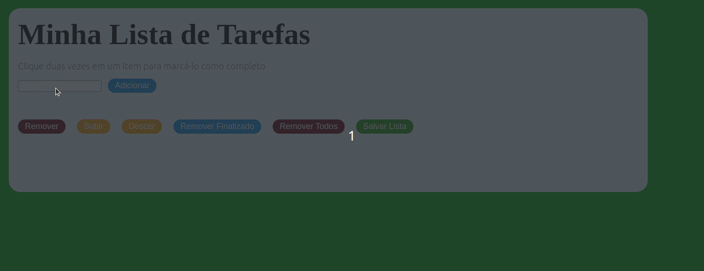

# Project To Do List

## Description

Project developed during the Trybe development course. Consists of a to do list, where tasks can be saved using local storage, updated, modified, added and removed.

## Tools

- HTML5;
- CSS3;
- Javascript ES6.

## Skills developed

- Handling CSS and HTML;
- DOM manipulation with Javascript;
- Use of Local Storage.